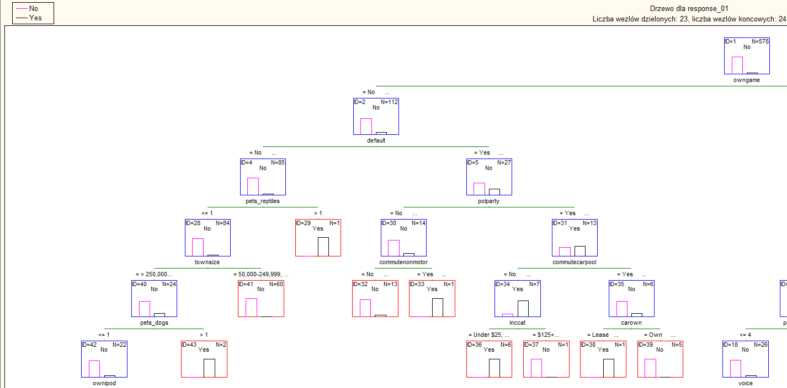
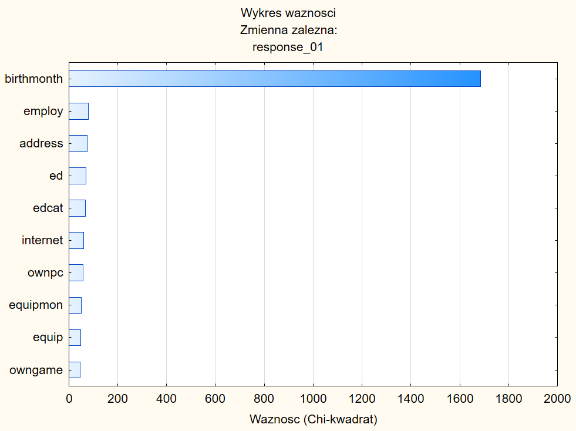
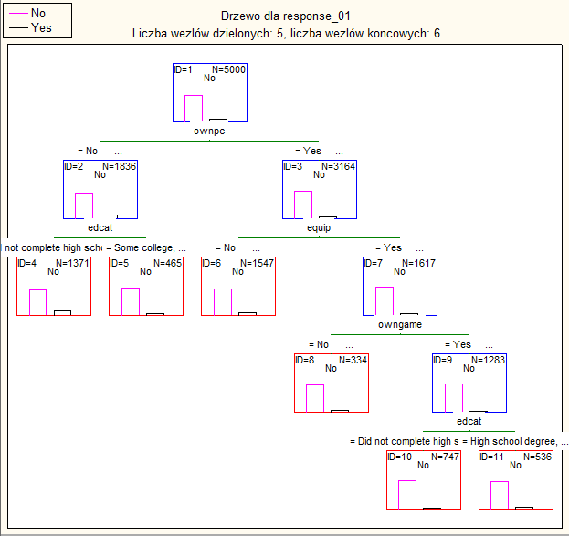
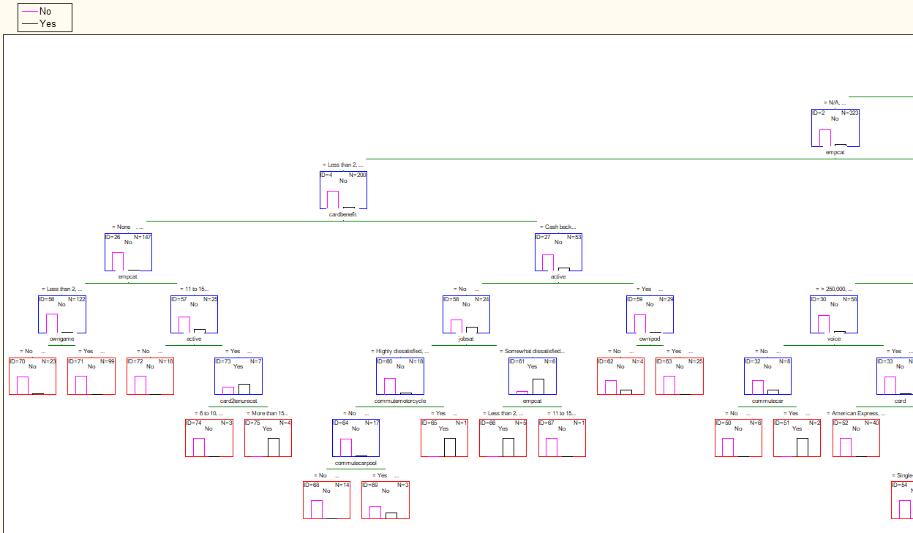
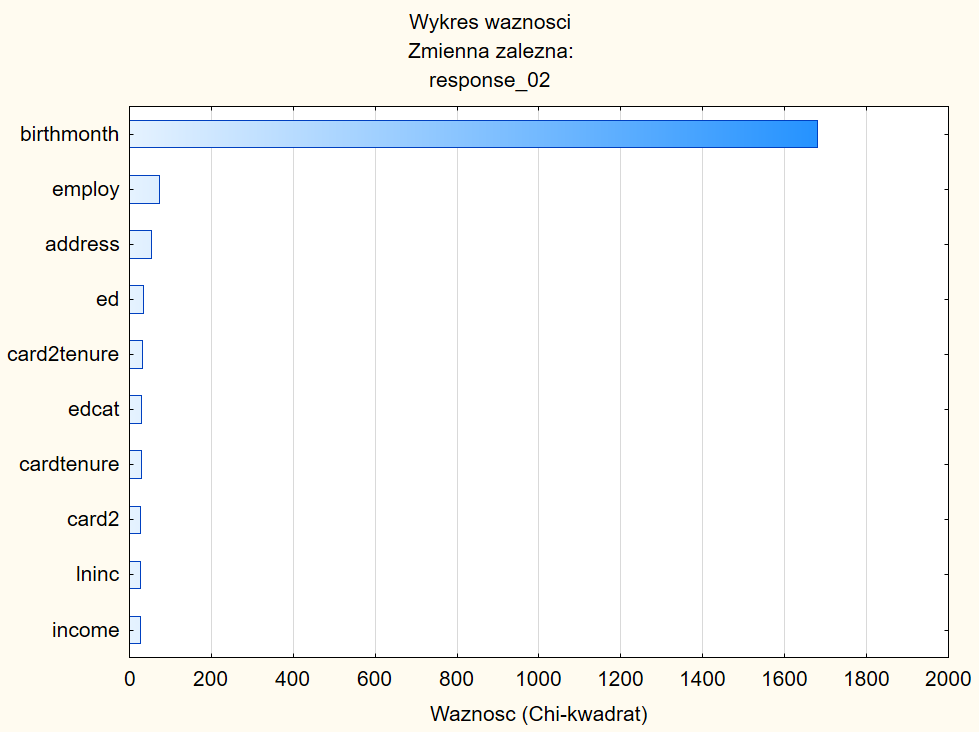
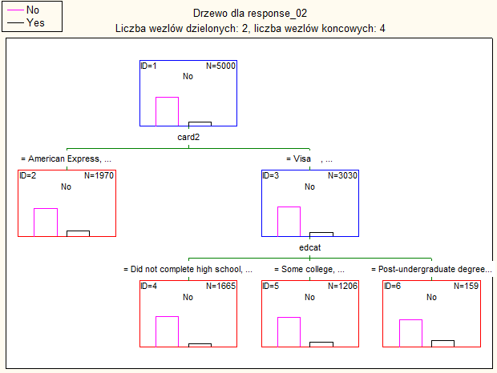
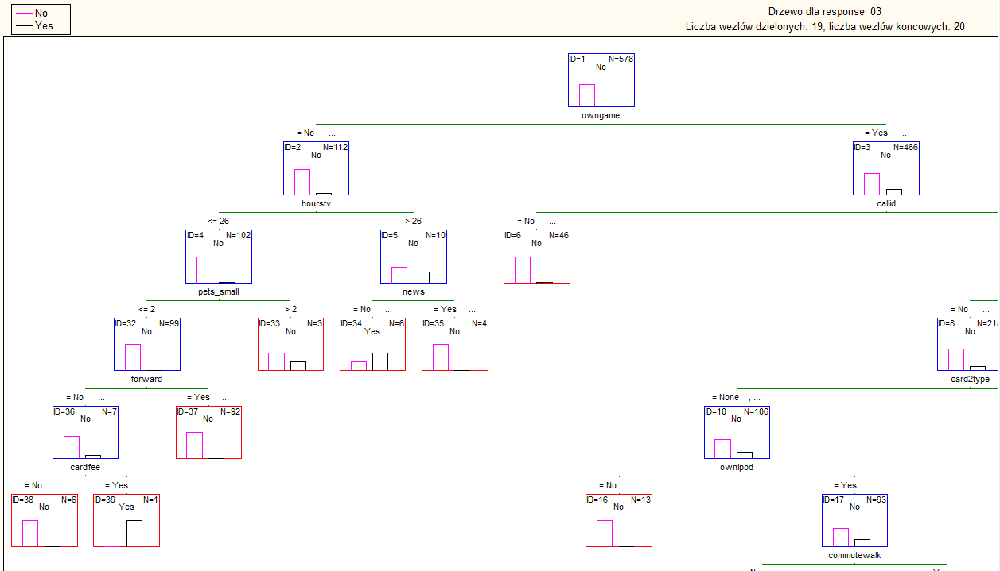
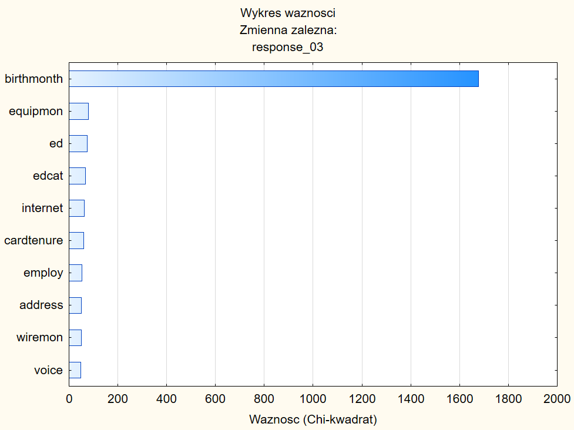
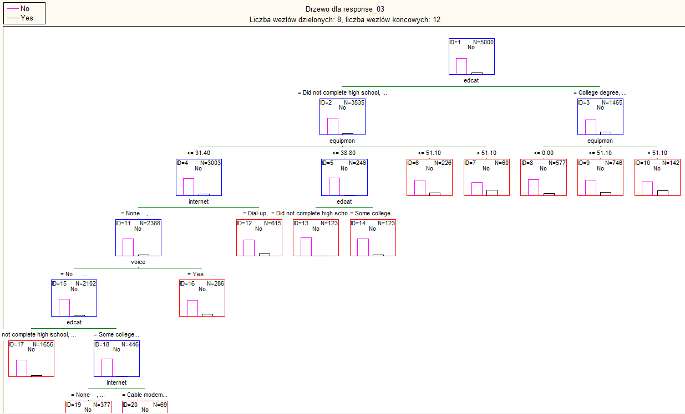

Marcin Wardyński
# Badanie prdyktorów dla predyktory.sdm

Ćwiczenie ma na celu przybliżenie metody wyboru parametów, które mają największy wpływ na predykcję wartości wyjściowych.  
W każdym z dalszych podpunktów przedstawię drzewo decyzyjne CHAID, które zostało utworzone dla predykcji wartości atrybutów: response_01, response_02 i response_03 dwukrotnie. Za pierwszym razem drzewo obejmuje wszyskie cechy modelu, za drugim natomiast tylko dziesięć najbardziej istotnych cech.  

## Obserwacje

W każdym z poniższych podpunktów widzimy, że drzewo utworzone na podstawie mniejszej liczby cech jest dużo płytsze, co ma swoje wady, ale i zalety.  

Przez spłycenie drzew straciliśmy bardzo ważną informację, a mianowicie jednoznaczne wskazanie zbioru cech, dla których szansa na odpowiedź od korespondenta na ofertę jest największa, a ta informacja może być dla nas bardzo interesująca. Jeśli interesuje nas dokładny zbiór cech korespondentów odpowiadających na ofertę, to musimy sięgnąć po drzewo CHAID pełnej głębokości.

Spłycone drzewo CHAID do dziesięciu najważniejszych cech daje nam pewne przybliżenie dokładnego podziału, dzięki czemu możemy na jego podstawie wybrać zbiór adresatów ofert o większej szansie na odpowiedź, jednakże unikając nadmiernego dopasowania predykcji, a więc overfittingu.  

Na powyższym przykładznie widzimy, że wybór cech użytych do stworzenia drzewa CHAID zależy od tego, do czego będziemy to drzewo wykorzystywać i tak przy eksploracji danych głębsze drzewo może być lepszym wyborem, podczas gdy przy procesie decyzyjnym jego spłaszczenie da pozytywny efekt.

## CHAID dla atrybutu response_01

Ponieżej fragment drzewa CHAID dla pełnej listy uwzględnionych atrybutów:

A tutaj dziesięć najważniejszych wybranych cech:  

i drzewo CHAID dla nich:  

## CHAID dla atrybutu response_02

Drzewo CHAID dla wszystkich cech:  

Dziesięć najważniejszych cech dla predykcji *reponse_02*  

Drzewo CHAID dla dziesięciu najważniejszych cech dla predykcji *reponse_02*  

## CHAID dla atrybutu response_03

Drzewo CHAID dla wszystkich cech:  

Dziesięć najważniejszych cech dla predykcji *reponse_03*  

Drzewo CHAID dla dziesięciu najważniejszych cech dla predykcji *reponse_03*  
