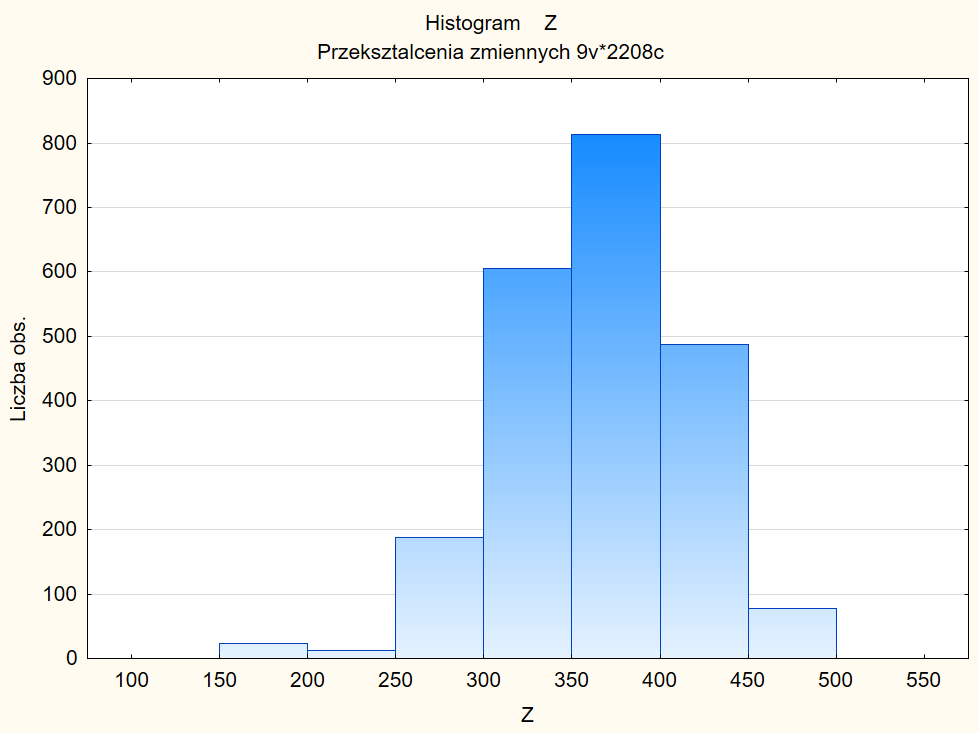
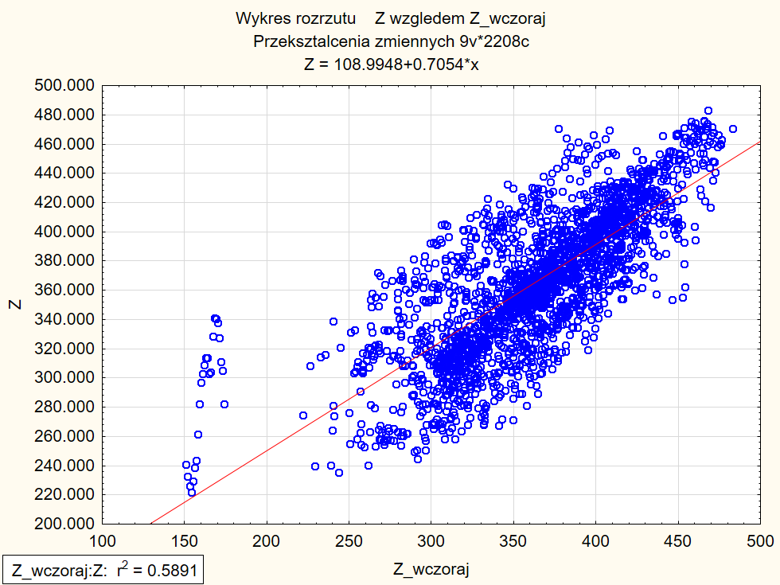
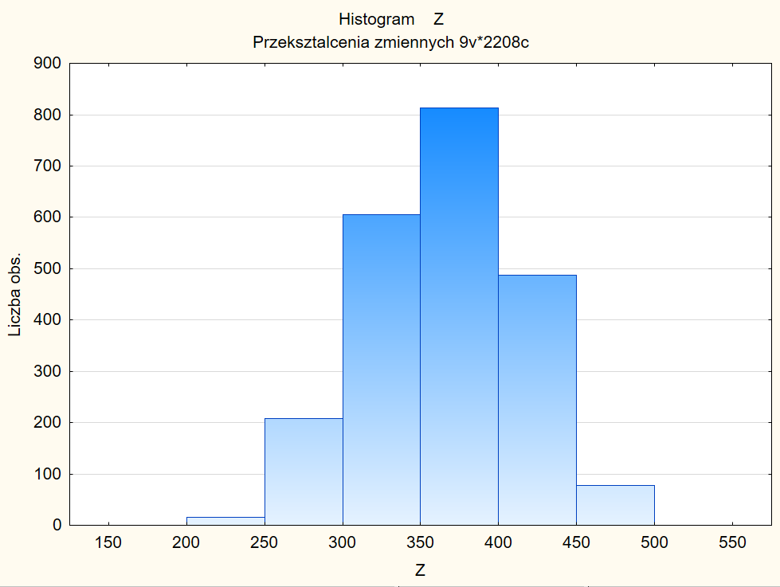
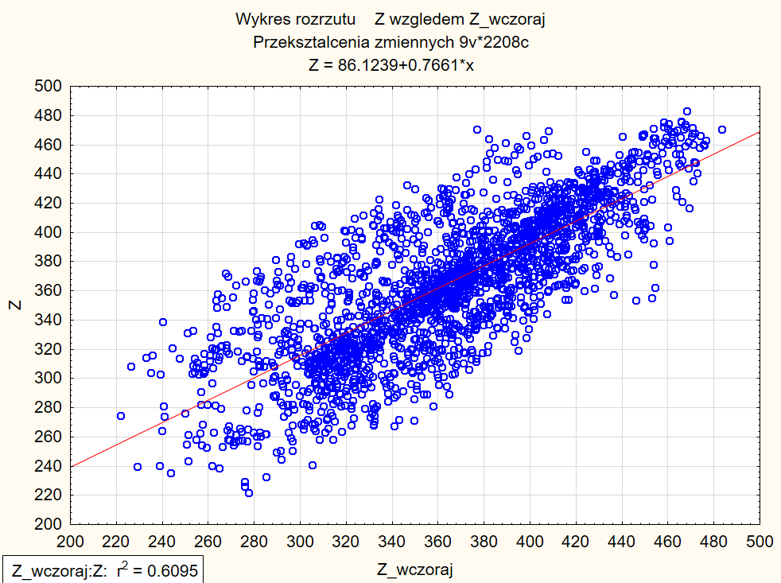
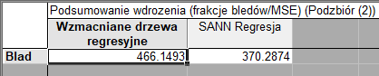
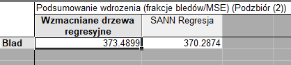
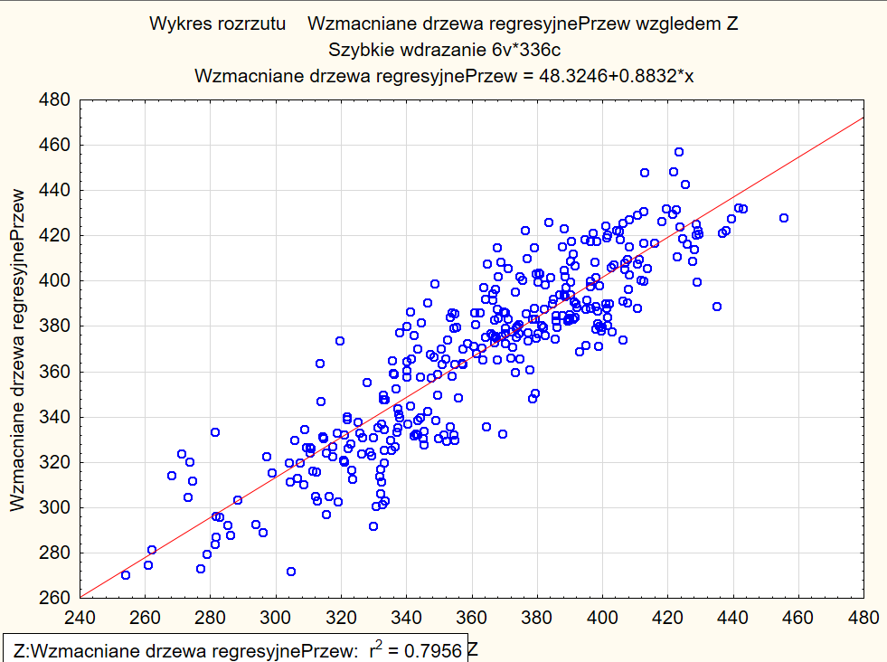
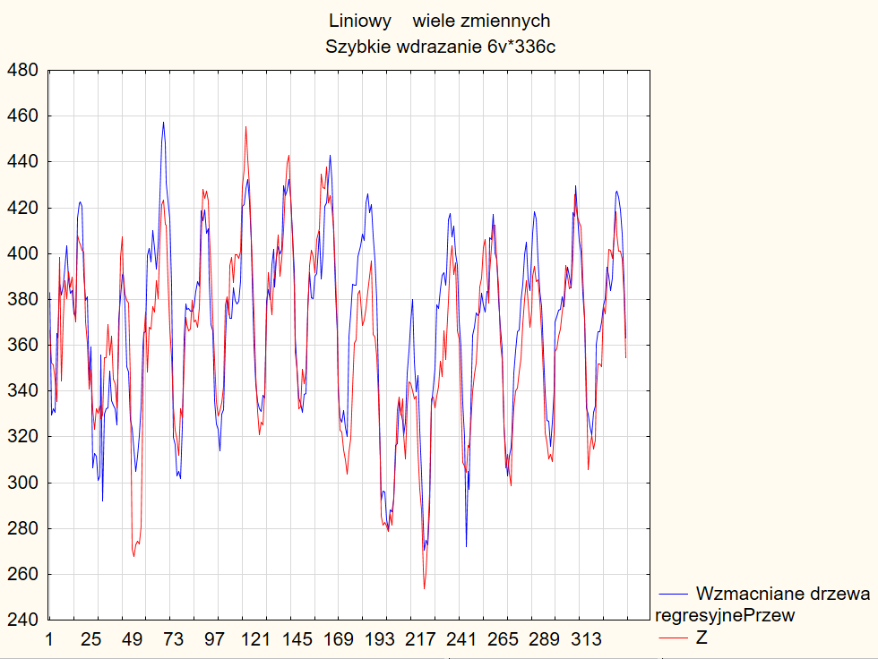

Marcin Wardyński
# Przewidywane zapotrzebowanie na energię

Ćwiczenie ma na celu przedstawienie sposobu na stwierdzenie nieścisłości w danych wejściowych i ich ręcznym napriawieniu, następnie na stworzeniu raportu o jakości danych i automatycznym oczyszczeniu danych na jego podstawie. Ostatecznie oczyszczone dane podzielimy na podzbiór treningowy i testowy, aby za pomocą wzmacniancyh drzew regresyjnych, które porównamy z sieciami neuronowymi, przedstawić predykcję zapotrzebowania energetycznego na podstawie danych wejściowych.

## Nieścisłości w danych wejściowych
Po zaprezentowaniu danych z pliku *prognoza.sta* w formie histogramu dla kolumny *Z* oraz diagramu rozrzutu dla kolumn *Z* i *Z_wczoraj*, widzimy pewne anomalie na tych wykresach, jak:
- słupki histogramu nie podążające w pełni za typowym w tym przypadku rozkładem Gaussa i pierwsy słupek jest wyższy od drugiego

- Początkowe dane diagramu rozrzutu, których rozmieszczenie wydaje się być nieadekwatne

Na podstawie tych diagramów możemy łatwo odnaleźć wiersze zawierające błędy i przyjrzeć się im, w celu ich naprawy.
W tym laboratorium zostały one naprawione w pliku *prognoza_ok.sta*

Tak wyglądają dwa powyższe wykresy z naprawionymi danymi wejściowymi, widzimy że powyźsze anomalie już nie występują:
- histogram  

- wykres rozrzutu  

## Jakość danych i ich zautomatyzowane czyszczenie

W kolejnym kroku zautomatyzowany proces do generownia raportu ze sprawdzenia jakości danych tworzy taki raport i na jego podstawie usuwa kolumnę *Zachmurzenie*, o której zbyteczności przez brak danych wiedzieliśmy już po wstępnym przyjrzeniu się histogramowi z poprzedniego punktu.

## Predykcja zapotrebowania na energię

Przechodzimy do zasadniczej części ćwiczenia i dzielimy zbiór danych na część treningową i testową, aby nauczyć model predykcyjny. Jako taki model predykcyjny posłużą nam wzmacniane drzewa regresyjne, a ich skuteczność porównamy z sieciami neuronowymi. Dla domyślnej wartości modelu z drzew regresyjnych uzyskujemy dość spory błąd na tle sieci neuronowej

Dlatego zmieniamy liczbę drzew na 900 i maksymalną liczbę węzłów na 7. Po takich adaptacjach błąd drzew regresyjnych jest bardzo zbliżony do sieci neuronowej i wynosi:

Kończąc ćwiczenie porównujemy predykcje dla zbioru testowego z oczekiwanymi wartościami. W tym celu używamy wykresu rozrzutu dla tych dwóch wartości i nie widzimy żadnych podejrzanych rozkładów punktów na płaszczyźnie.

Co więcej, wykres liniowy prezentujący na jednym wykresie wartości rzeczywiste i predykcje modelu na zużycie energii elektrycznej potwierdza skuteczność modelu dla większości przebiegu i tylko odstaje przy skrajnych wartościach amplitudy zużycia.

