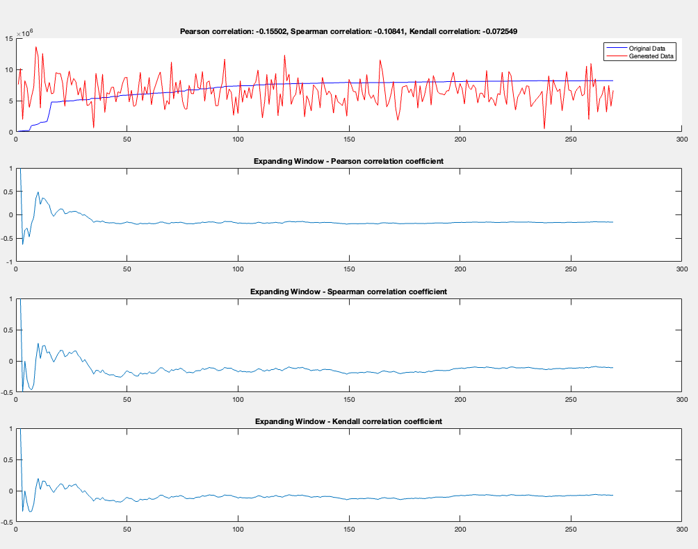
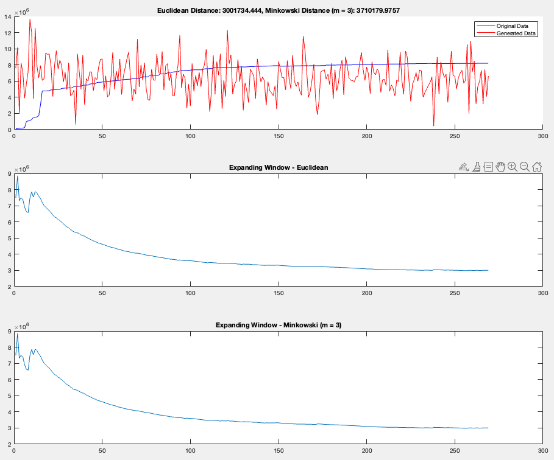
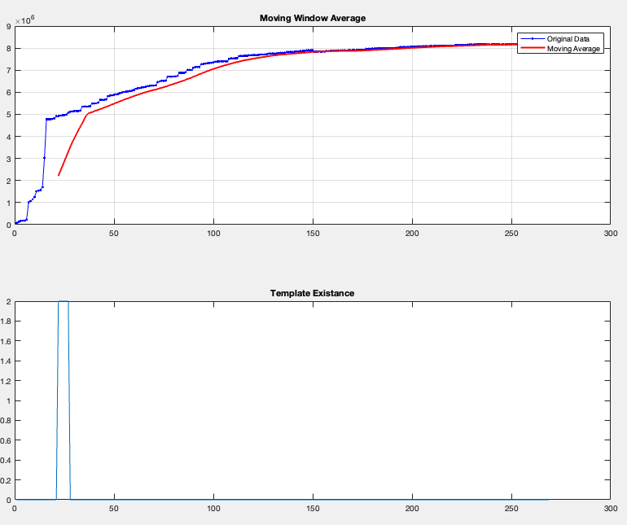
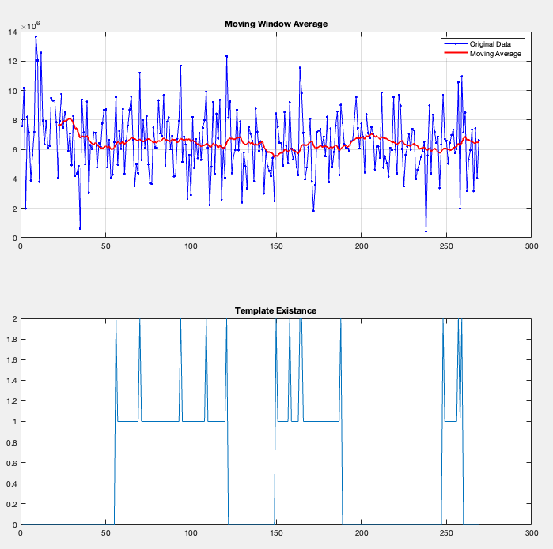
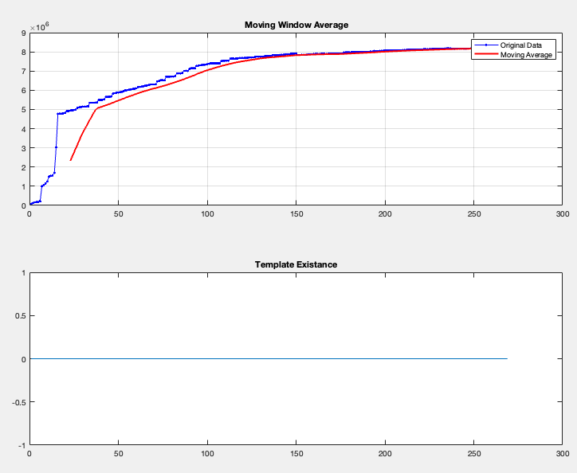
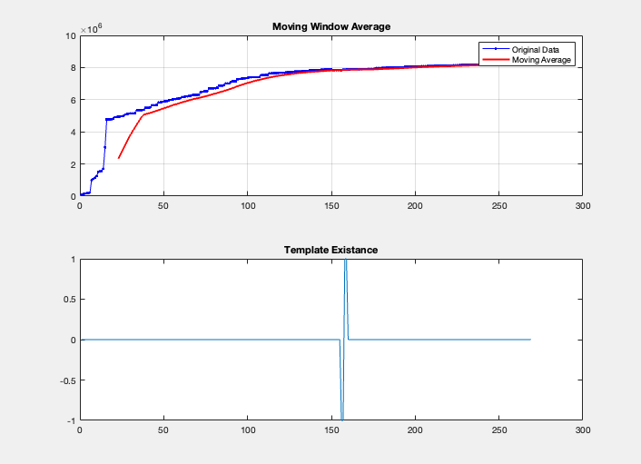
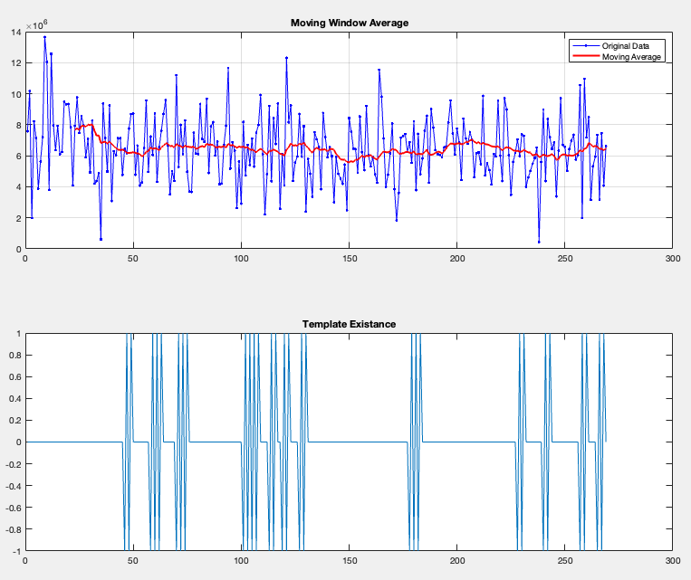
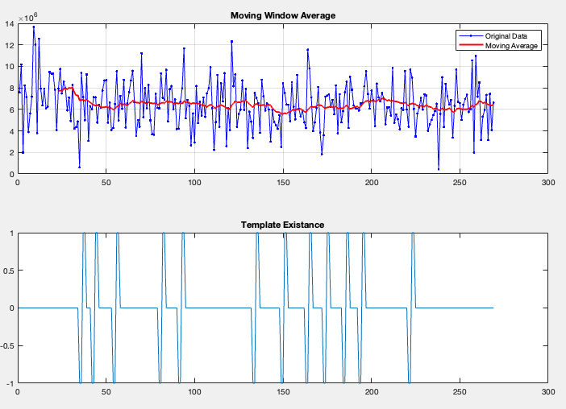

Autor: Marcin Wardyński (Pn, 13:15)

# Zadanie dodatkowe

## 1 i 2. Wygeneruj szereg i oblicz korelację z danymi o uchodźcach
### Kod wykorzystany w zadaniu: ex_ext_1_2.m

Wygenerowany szereg ma wartości podobne do tych z pliku o uchodźcach, gdyż do ich wygenerowania użyłem wartości średniej oraz odchylenia standardowego zbliżone do tych dla danych z pliku. Jednakże umiejscowienie poszczególnych wartości w czasie będzie losowe, przez co szeregi te znacznie się różnią.

Korelację obliczyłem trzema różnymi rodzajami współczynników i wynosi ona kolejno dla całego zbioru danych:

- współczynnik korelacji Pearson-a: -0.15502
- współczynnik korelacji Spearman-a: -0.10841
- współczynnik korelacji Kendall-a: -0.072549

Generator szeregu losowego utworzył szereg, który tylko w niewielkim stopniu jest skorelowany z wartościami o uchodźcach. Odwrotną korelację pomiędzy 7-15% wskazały wszystkie rodzaje współczynników korelacji.

Sprawdźmy jeszcze używając rozszerzanego okna, jak współczynnik korelacji zmieniał się w zależności od uwzględnionych danych:

Okazuje się, że dla około czterdziestu pierwszych wartości, współczynnik korelacji oscyluje znacznie i w zależności od sposobu obliczania korelacji, potrafi wahać się nawet między -50%, a 50%. Warto zaznaczyć, że amplituda wahań jest największa dla współczynnika Pearson-a, a najmniejsza dla Kendall-a.  
Tak dużą zmienność współczynnika korelacji można przypisać faktowi, że w początkowym okresie zarówno dane wygenerowane, jak i o uchodźcach, są bardzo zmienne, a współczynniki wyznaczane są dla mniejszej ilości punktów. Wraz z rozszerzaniem analizy dla coraz dłuższego szeregu czasowego, dane o uchodźcach się stabilizują, a wahania szeregu wygenerowanego uśredniają.
Można zauważyć, że już od około pięćdziesiątego elementu szeregu, współczynniki korelacji stabilizują się w okolicach swoich finalnych wartościach.

## 3. Podobieństwo szeregów
### Kod wykorzystany w zadaniu: ex_ext_3.m
Skrypt zakłada, że dane zostały już załadowane do przestrzeni roboczej przy użyciu pierwszego skryptu.

Do wyznaczenia podobieństw szeregów obliczyłem ich dystans wykorzystując dwie metryki:

- euklidesową - dystans: 3001734.444
- minkowskiego (m = 3) - dystans: 3710179.9757

Jak w poprzednim zadaniu, nie poprzestałem na analizie podobieństw dla całego przedziału czasowego, lecz przy użyciu okna rozszerzanego zbadałem przebieg zmiany podobieństwa dla coraz szerszego okna danych wejściowych.

Widzimy, że dla początkowego przedziału czasowego, różnica pomiędzy szeregami jest największa. Wynika to z faktu, że liczba uchodźców zaczynała od bardzo małych wartości i dopiero rosła, podczas gdy szereg wygenerowany od samego początku wyznaczał wartości rozrzucone wokół średniej dla całego przedziału. Wraz z upływem czasu, gdy dane o uchodźcach zbliżyły się do średniej dla całego przedziału, dystans pomiędzy szeregami zmalał i wydaje zbiegać do wartości 3 000 000 dla obydwu metryk.

## 4. Wzorce wartości skokowych
### Kod wykorzystany w zadaniu: ex_ext_4_a.m
Skrypt zakłada, że dane zostały już załadowane do przestrzeni roboczej przy użyciu pierwszego skryptu.

Skrypt ukazuje przedziały, w których doszło do co najmniej trzykrotnego przekroczenia wartości średniej z 22 ostatnich pomiarów o 50%. Zarówno przedziały, jak i wartości szczytowe są wylistowane, oraz przedstawione na wykresie.  
Przy wizualizacji przedziałów na wykresie, używam dodatkowego wykresu, który przyjmuje wartość 1 dla odpowiadających mu danych znajdujących się w przedziale, oraz wartość 2 dla peak-ów o wartości średniej razy 1,5. Przedział zamyka się, jeśli liczba następujących po ostatnim szczycie danych przekroczy ustalony parametr `template_max_gap = 25`. Obrany przeze mnie sposób wizualizacji pozwala w łatwy sposób zaznaczyć przedziały szeregu, które przez spełnianie zadanego wzorca, mogą nas szczególnie interesować.

Dla danych o uchodźcach, wzorzec może zostać odnaleziony tylko raz, i to wyłącznie w początkowych danych szeregu. Późniejsze dane charakteryzują się zbyt małą zmiennością, aby spełnić warunki wzorca, natomiast w odnalezionym wzorcu wszystkie punkty przedziału przekraczają średnią o 50%.

Ciekawsze rezultaty możemy zaobserwować dla szeregu wygenerowanego o dużo większej zmienności. W tym przypadku odnajdujemy trzy przedziały spełniające kryteria wzorca, z odpowiednio pięcioma, czterema i trzema wartościami szczytowymi przekraczającymi średnią o 50%.

## 4. Wzorce sekwencji o zmiennej wartości znaku
### Kod wykorzystany w zadaniu: ex_ext_4_b.m
Skrypt zakłada, że dane zostały już załadowane do przestrzeni roboczej przy użyciu pierwszego skryptu.

Tym razem odnajdujemy wszystkie wzorce, gdzie w kolejnych próbkach wartość szeregu czasowego jest większa lub mniejsza od jego wartości średniej. Tak np. zdefiniowanie wzorca `-,+,-,+` poprzez ustawienie zmiennej `template = [-1, 1, -1, 1];`, wyszukuje przedziały, gdzie kolejne wartości szeregu są raz mniejsze, raz większe od średniej, i tak zadaną ilość razy (np. cztery w tym przypadku).  
Jak i uprzednio, przedziały odnalezionych wzorców listujemy i zaznaczamy na pomocniczym wykresie, gdzie wartości szeregu odpowiadające znakom `-/+`, są odpowiednio przedstawiane poprzez wartość `-1/1`.
Skrypt odnajduje wszystkie przedziały z zadanym wzorcem, również te nakładające się częściowo na już odnaleziony przedział.

Wykres z danymi o uchodźcach jest na tyle mało zmienny, że wzorzec `-,+,-.+` nie został odnaleziony ani jeden raz, natomiast `-,-,+,+` tylko raz.

`-,+,-,+`:  
  
`-,-,+,+`:  
  

Szereg wygenerowany ma znacznie większą zmienność, to i wzorce został odnaleziony znacznie częściej.

`-,+,-,+`:  
  
`-,-,+,+`:  
  