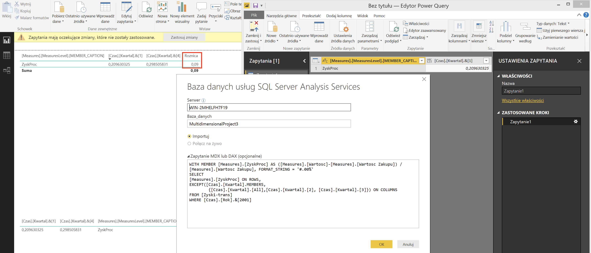
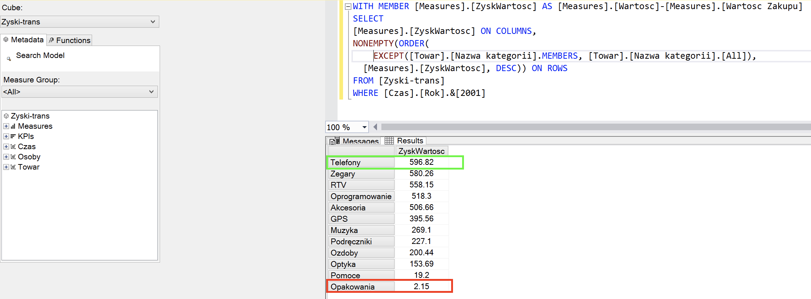
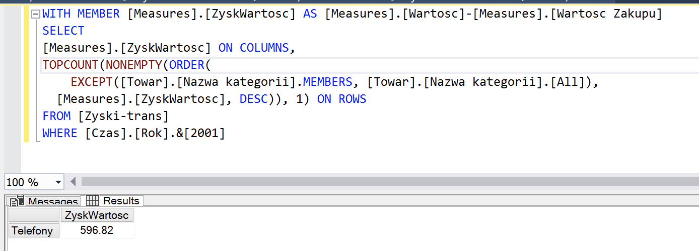
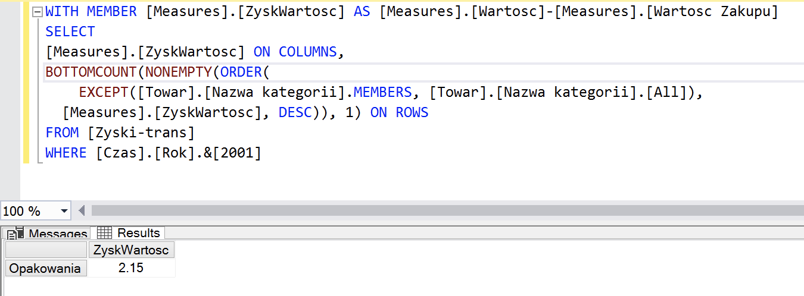
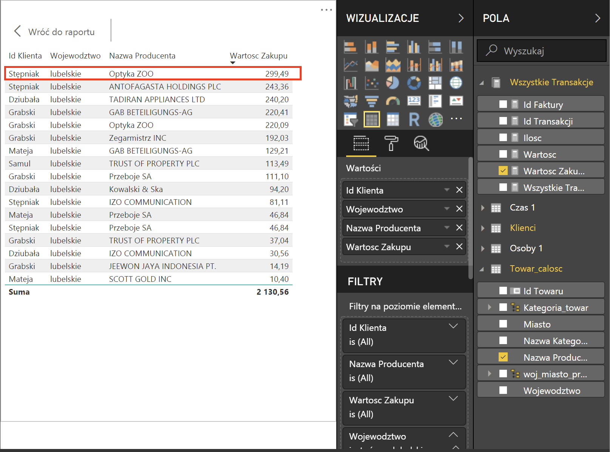
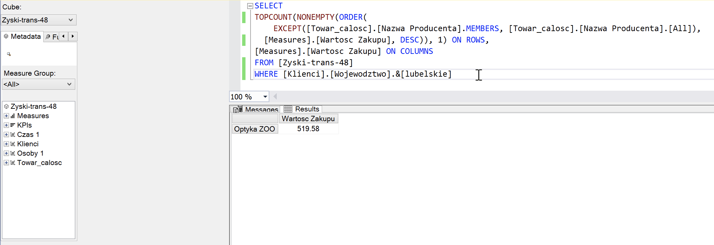
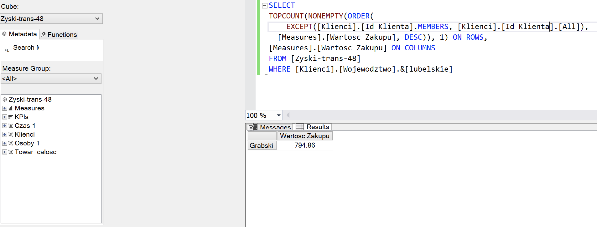

Autor: Marcin Wardyński (Pn, 13:15)

# Zadanie dodatkowe

## Ile wynosi różnica pomiędzy procentowymi wynikami zysku dla pierwszego i ostatniego kwartału 2001 roku oraz dla jakich kategorii towaru uzyskano największą i najmniejszą wartość zysku w tym roku ?

#### Różnica pomiędzy procentowymi wynikami zysku dla pierwszego i ostatniego kwartału 2001 roku - zapytanie MDX użyte w Power BI do wyliczenia róźnicy

Wynik: *0,09*

#### Kategorie towaru o największej i najmniejszej wartości zysku w roku 2001

Kategoria o największej wartości zysku: *Telefony*  
Kategoria o największej wartości zysku: *Opakowania*

Wszystkie kategorie posortowane malejąco po wartości zysku, z wyłączeniem kategorii bez transakcji

Możemy też zawęzić otrzymany wynik do największej i najmniejszej wartości używając odpowiednio funkcji `TOPCOUNT` i `BOTTOMCOUNT`

## Proszę podać nazwę producenta oraz nazwisko klienta dla których wystąpiła największa wartość zakupu w województwie lubelskim.

#### Dla pojedynczej transakcji

Klient: *Stępniak*, producent: *Optyka ZOO*

#### Kumulatywnie i oddzielnie dla producenta i klienta

Producent: *Optyka ZOO*

Klient: *Grabski*

